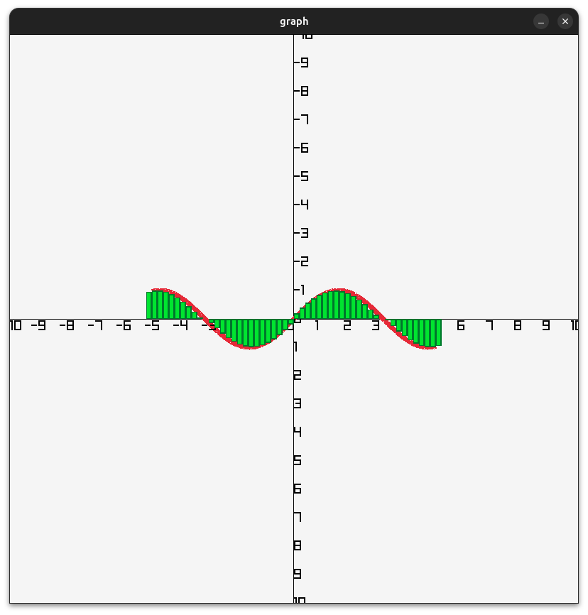

# Riemann Sum Visualizer

An interactive graphing tool that visualizes **Riemann sums** (left-endpoint approximation) for `f(x) = sin(x)` using [raylib](https://www.raylib.com/). Enter a bounds and partition count, and watch the approximated area rendered as rectangles under the curve in real time.

---

## Features

- Computes a **left Riemann sum** for `f(x) = sin(x)` over a user-defined interval `[a, b]`
- Renders the **sine curve** as a smooth red polyline
- Draws **green rectangles** representing each partition's area contribution
- Displays labeled **X and Y axes** with tick marks
- Supports **mouse wheel zoom** and **WASD keyboard panning**

---

## Controls

| Input | Action |
|---|---|
| Scroll wheel up | Zoom in |
| Scroll wheel down | Zoom out |
| `W` | Pan up |
| `S` | Pan down |
| `A` | Pan left |
| `D` | Pan right |
| Close window | Exit |

---

## How It Works

1. **Input**: The user provides lower bound `a`, upper bound `b`, and number of partitions `n`.
2. **Partition width**: `Δx = (b - a) / n`
3. **Sum**: For each partition starting at `x`, the area of the rectangle is `f(x) · Δx`. These are accumulated into a total.
4. **Graph curve**: A second set of points is sampled at high resolution (`precision = 9999`) to draw a smooth curve independently of the partition count.
5. **Rendering**: raylib draws the axes, the smooth curve, and the approximation rectangles each frame. Zoom and pan state is updated per frame from input.

---

## Notes

- The function `f(x)` is defined in one place at the top of `main.cpp` — change it there to visualize a different curve.
- Handles `inf` return values from `sin(x)` gracefully by substituting `0`.
- The initial window size is **800×800** and can be adjusted via `screenX` / `screenY` at the top of the file.
